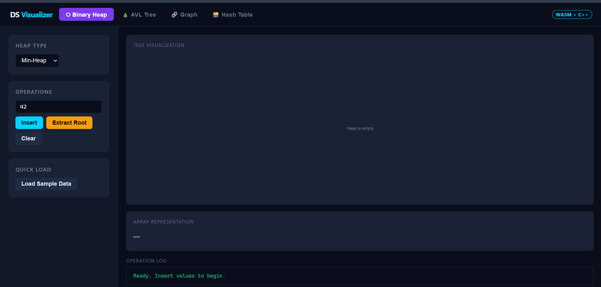
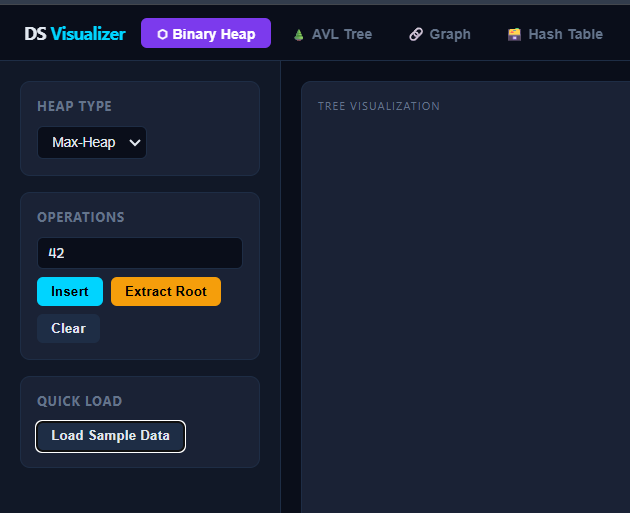
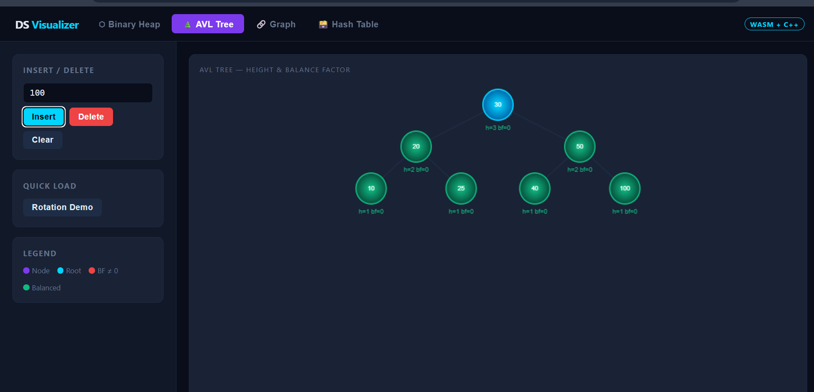
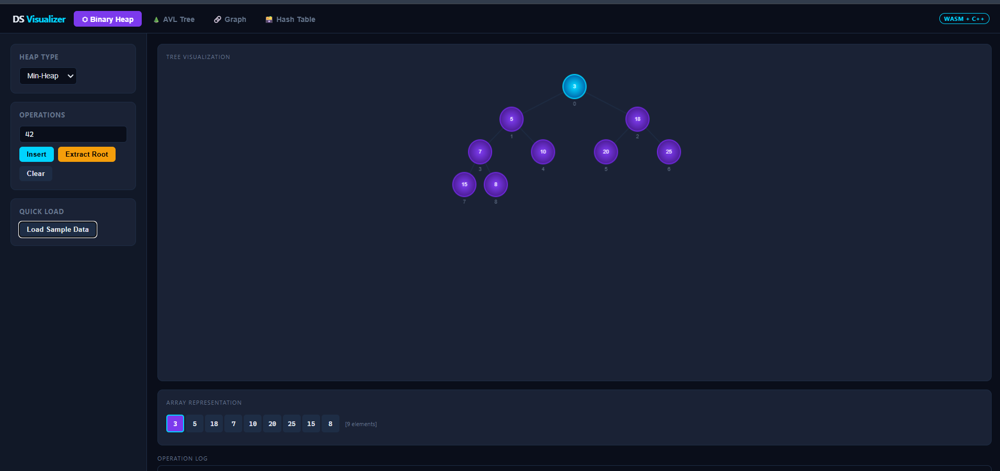
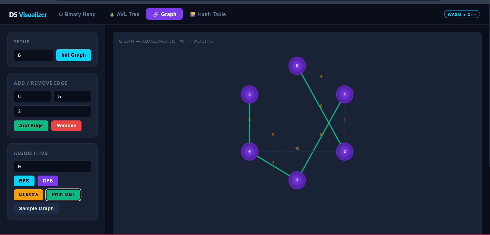
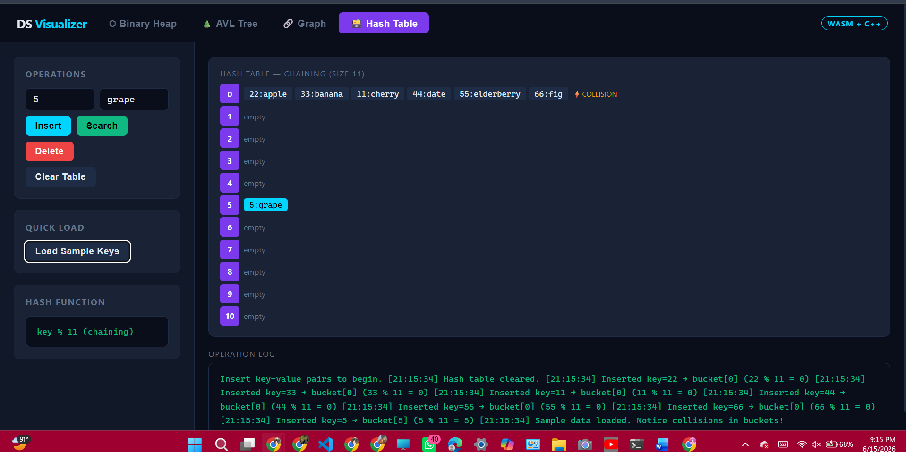

# Data Structure Visualizer

A web-based Data Structure Visualizer designed to help students understand how different data structures work through interactive animations and visual representations.

## 📌 Project Overview

This project provides a graphical visualization of common data structures. Users can perform operations and observe how data structures change in real time, making learning easier and more engaging.

## ✨ Features

* Interactive visualization of data structures
* Step-by-step execution of operations
* User-friendly interface
* Real-time animations
* Educational and beginner-friendly design

## 🗂️ Implemented Data Structures

* Binary Search Tree (BST)
* Heap
* Hash Table
* Graph
* AVL

## 🛠️ Technologies Used

* HTML5
* CSS3
* JavaScript
* Bootstrap (if used)

## 🚀 Live Demo

Website Link:
[Add Your Live Demo Link Here]

## 📸 Screenshots

### Home Page



### HEAP Visualization



### AVL Visualization



### Binary Search Tree Visualization



### Graph Visualization



### Hash Table Visualization




## 📖 How to Use

1. Open the application.
2. Select a data structure from the menu.
3. Enter values as required.
4. Perform operations such as:

   * Insert
   * Delete
   * Search
   * Traverse
5. Observe the visualization and animations.

## 📂 Project Structure

```text
Data-Structure-Visualizer/
│
├── index.html
├── css/
│   └── style.css
│
├── js/
│   ├── heap.cpp
│   ├── bst.cpp
│   ├── avl.cpp
│   ├── graph.bst
│   ├── hash.bst
│   └── index.html
│
├── screenshots/
│
└── README.md
```

## 🎯 Learning Objectives

This project was developed to:

* Improve understanding of data structures.
* Visualize internal operations of data structures.
* Support students in learning Data Structures and Algorithms (DSA).
* Provide an interactive educational tool.

## 👨‍💻 Team Members

**Raazia Mehmood**
Roll Number: 24F-0614

## 🔗Links

LinkedIN
www.linkedin.com/in/raazia-mehmood-221995324

LiveDemo 
https://raazia-mehmood16.github.io/Data-Dtructure-Visualizer/
Filter deployments

## 📄 License

This project is developed for educational purposes.

## ⭐ Acknowledgements

Special thanks to our instructors and university for providing guidance and support throughout the development of this project.
